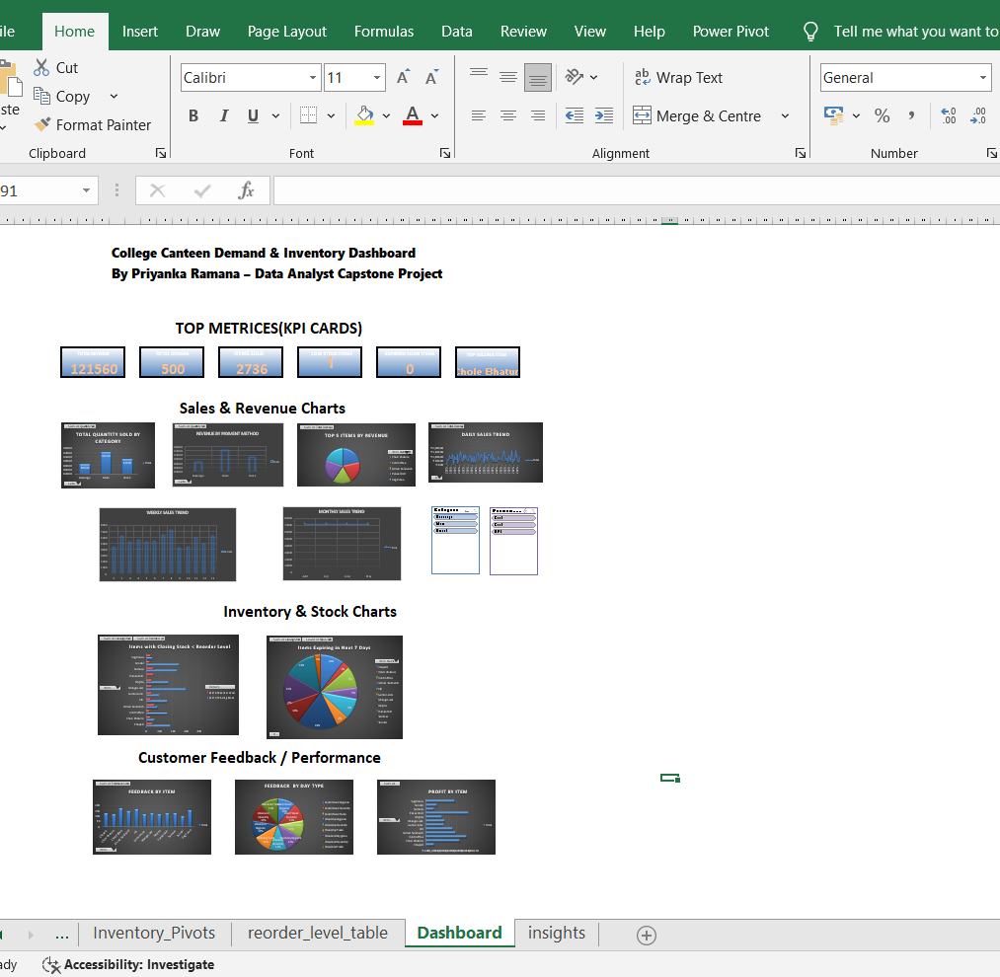

# 📊 College Canteen Demand & Inventory Optimization Dashboard

## 🔍 About
This capstone project analyzes and optimizes the sales, stock, and demand of a college canteen using Microsoft Excel.

## 🛠 Tools Used
- Microsoft Excel (Formulas, Pivot Tables, Charts, Slicers)
- Data Cleaning & Transformation
- Dashboard Design

## 📌 Key Insights
- Top-selling and low-performing food items
- Inventory vs Reorder Level tracking
- Expiry alerts
- Daily, weekly, and monthly sales trends

## 📈 Dashboard

## 🧠 Future Integration
- Power BI
- SQL
- Python (Pandas, Matplotlib)

---

> Developed by Priyanka for a Data Analyst interview portfolio.
